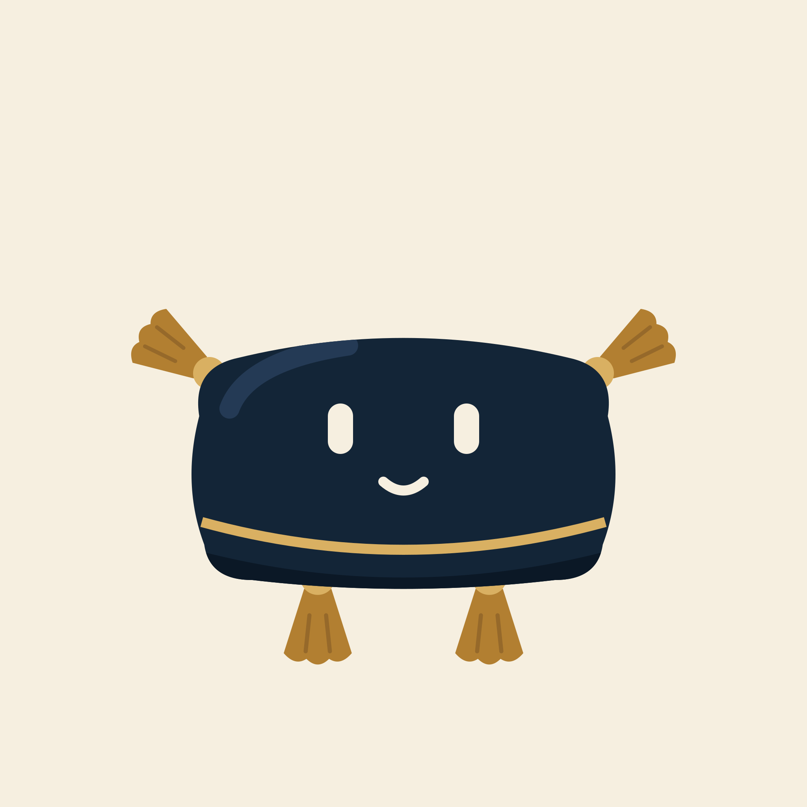
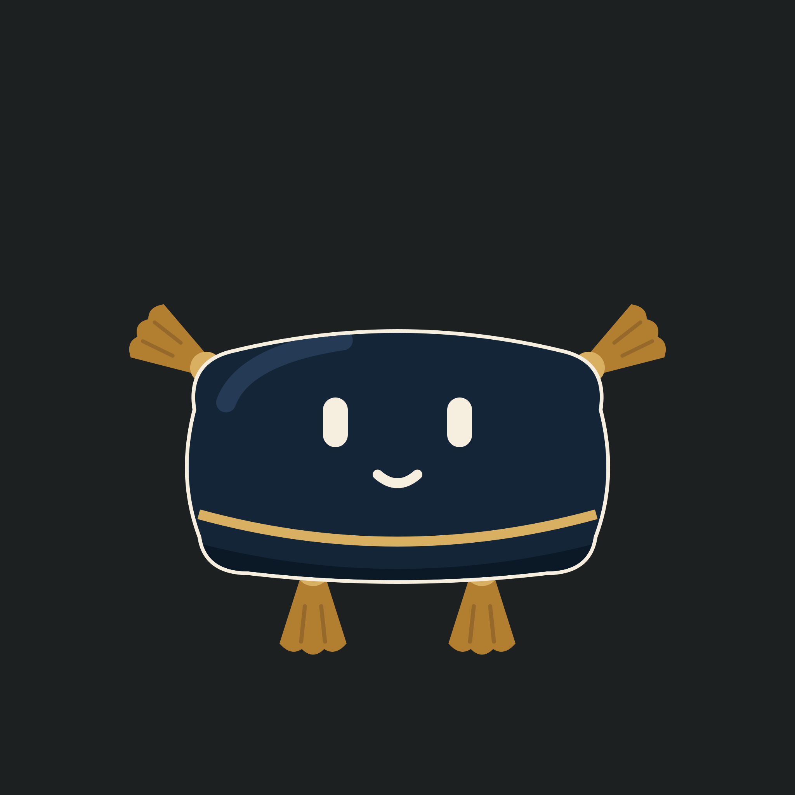
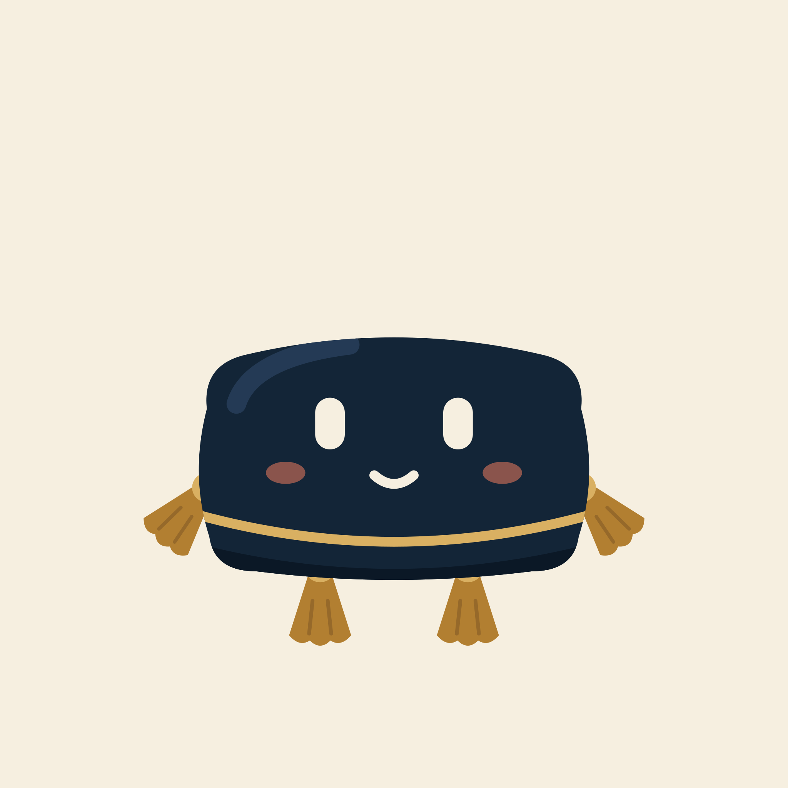
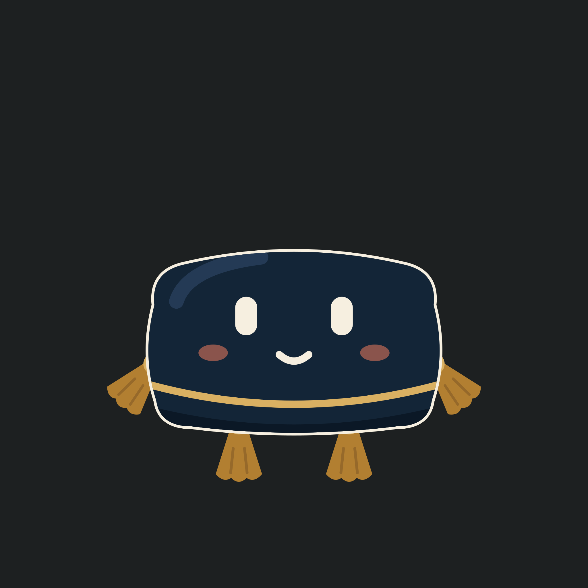
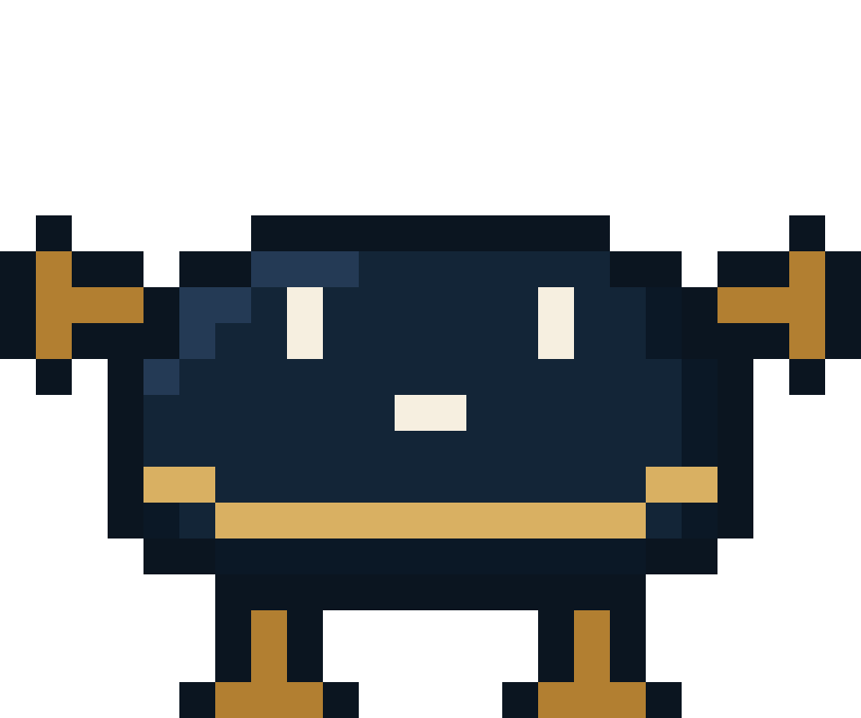
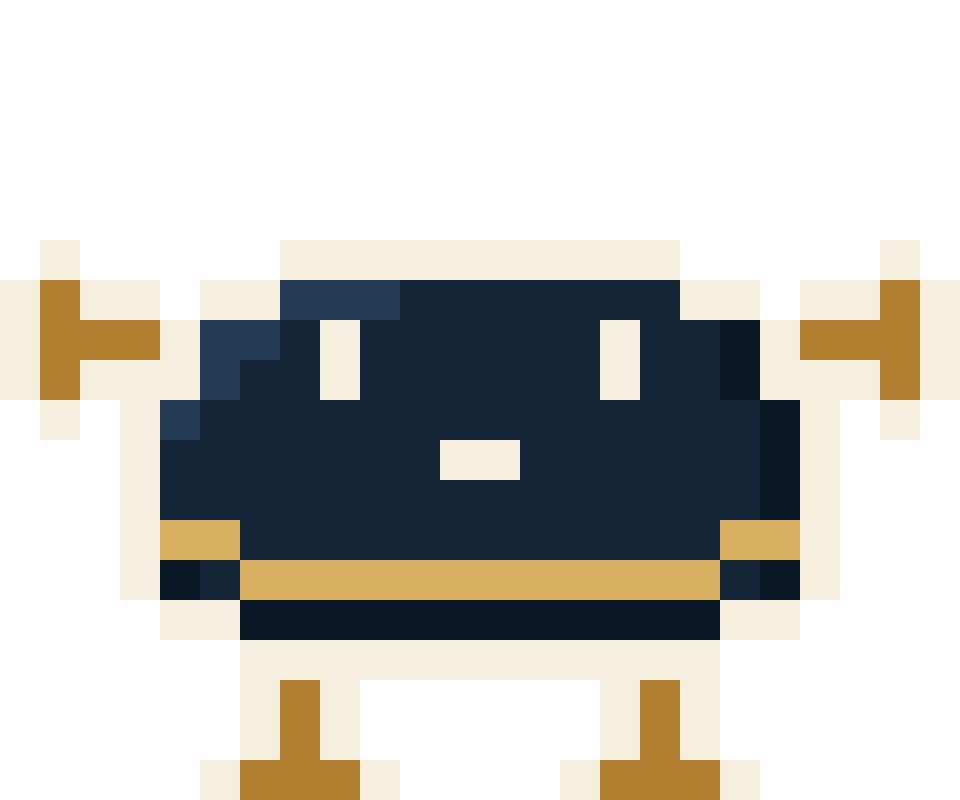

# Zabuton mascot


**The floor cushion that keeps the zabuton apps company.**

Artwork for the mascot of the [zabuton](https://github.com/zabuton-app) app
series: a navy *zabuton* (a Japanese floor cushion) whose four corner tassels
serve as arms and legs.

The repository holds two sets of assets:

- **Vector illustrations** — two poses, as SVG and 2048px PNG
- **Pixel art** — a 24×20 sprite with 16 animations, as per-frame SVG and PNG
  plus looping GIFs

Every asset comes in a regular version for light backgrounds and an `-on-dark`
version with a cream outline, so the navy body stays readable on dark
backgrounds.

## Vector illustrations

| Variant | Light | On dark |
| ------- | ----- | ------- |
| `mascot-a` — arms raised |  |  |
| `mascot-c-no-enso` — arms down, blushing |  |  |

Each variant ships as an SVG and a 2048px-wide PNG (`<name>.svg` and
`<name>-2048.png`) in four flavors:

| Name | SVG canvas | Background |
| ---- | :--------: | ---------- |
| `<variant>` | 240×200 | Transparent |
| `<variant>-on-dark` | 240×200 | Transparent, cream outline |
| `<variant>-square` | 320×320 | Cream (`#f6efe0`) |
| `<variant>-on-dark-square` | 320×320 | Charcoal (`#1d2021`), cream outline |

## Pixel art

The pixel-art mascot is drawn on a 24×20 grid. The stills below are the first
`idle` frame, upscaled.

| Light | On dark |
| ----- | ------- |
|  |  |

### Animations

The GIFs below follow your GitHub theme: the regular version is shown in light
mode and the `-on-dark` version in dark mode.

| `idle` | `walk` | `hop` | `look-around` |
| :----: | :----: | :---: | :-----------: |
|  |  |  |  |

| `head-shake` | `cheer` | `work` | `sleep` |
| :----------: | :-----: | :----: | :-----: |
|  |  |  |  |

| `held` | `fall` | `land` | `fold` |
| :----: | :----: | :----: | :----: |
|  |  |  |  |

| `beg` | `mouth-open` | `munch` | `yum` |
| :---: | :----------: | :-----: | :---: |
|  |  |  |  |

### Frames and timing

Frame durations are the ones baked into the GIFs. A longer last frame is the
pause before the loop restarts.

| Animation | Frames | Frame durations (ms) |
| --------- | :----: | -------------------- |
| `beg` | 4 | 130, 130, 130, 130 |
| `cheer` | 2 | 200, 1000 |
| `fall` | 2 | 120, 120 |
| `fold` | 2 | 180, 980 |
| `head-shake` | 3 | 140, 140, 940 |
| `held` | 2 | 220, 220 |
| `hop` | 2 | 120, 920 |
| `idle` | 3 | 600, 600, 600 |
| `land` | 2 | 110, 910 |
| `look-around` | 3 | 450, 450, 1250 |
| `mouth-open` | 2 | 260, 260 |
| `munch` | 3 | 160, 160, 960 |
| `sleep` | 2 | 900, 900 |
| `walk` | 4 | 160, 160, 160, 160 |
| `work` | 2 | 220, 220 |
| `yum` | 4 | 240, 240, 240, 1040 |

### Pixel-art files

| Path | Contents |
| ---- | -------- |
| `pixel/svg/<animation>-<n>.svg` | One frame on a 24×20 `viewBox` |
| `pixel/png/<animation>-<n>.png` | One frame, 240×200 (10× scale), transparent |
| `pixel/gif/<animation>.gif` | Looping animation, 240×200, transparent |
| `pixel/idle-<size>.png` | First `idle` frame at 960×800 and 1920×1600 |

Frame numbers `<n>` start at 1. Append `-on-dark` before the extension for the
outlined version of any file, for example `pixel/png/walk-3-on-dark.png`.

## Palette

| Color | Hex | Used for |
| ----- | --- | -------- |
| Navy | `#132537` | Cushion body |
| Deep navy | `#0b1826` | Body shadow |
| Slate blue | `#243a55` | Highlight |
| Gold | `#d9b062` | Piping and tassel knots |
| Ochre | `#b27f31` | Tassels |
| Brown | `#96692a` | Tassel threads (vector only) |
| Coral | `#d9735a` | Blush on `mascot-c-no-enso` |
| Cream | `#f6efe0` | Eyes, mouth, `-on-dark` outline, `-square` background |
| Ink | `#0b1520` | Pixel-art outline (regular version) |
| Charcoal | `#1d2021` | `-on-dark-square` background |

## Directory layout

```text
.
├── mascot-a*.svg / *.png            # Vector variant A
├── mascot-c-no-enso*.svg / *.png    # Vector variant C
└── pixel/
    ├── idle-*.png                   # Upscaled idle stills
    ├── gif/                         # Looping animations
    ├── png/                         # Per-frame PNG
    └── svg/                         # Per-frame SVG
```
